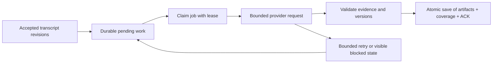

# Interview reliability and analysis quality

2026-09-15 · Proposed plan, not implemented. No configuration, model, budget, UI or stored meeting
has been changed by this planning work. Complements [live analysis](live-analysis.md),
[topic memory](topic-memory.md), [capture](macos-audio-capture.md) and [observability](observability.md).

## Evidence and current limitations
- User clarification, 2026-09-15: Mac capture is working. Do not treat capture transport or macOS
  permissions as the current blocker. Focus on transcript recognition/grouping, attribution and
  downstream analysis; retain existing capture behavior and diagnostics.
- The reported meeting has fragmented text, frequent unassigned remote voices and one broad thread.
  Screenshots establish these symptoms, not their root cause or the interview's complete topic count.
  The displayed thread cites roughly minute 24 while transcript rows show minute 49. Old citations
  are not themselves a processing watermark; compare actual coverage before inferring a stoppage.
- `MeetingView.tsx` inserts a **Correct speaker** button after each attributed final span inside the
  paragraph. It is interface text, not part of stored/provider transcript text. Multiple spans make
  the action appear embedded in every sentence. Display grouping currently uses speaker identity,
  attribution state, an eight-second gap and a sixty-second group window.
- The Deepgram adapter uses Nova-3, 16 kHz mono streams, interim results, punctuation and 300 ms
  endpointing. It uses `is_final` but does not retain `speech_final`, word confidence or provider
  request IDs as first-class capture diagnostics. Finalized fragments are not completed thoughts.
  [Deepgram distinction](https://developers.deepgram.com/docs/understand-endpointing-interim-results).
- Live/topic collection waits for four seconds without transcript updates or a twenty-five-second
  collection ceiling. Topic mode initially waits for 35 words; it can subsequently process shorter
  updates. One bounded model request handles routing and analysis together. There is no one-topic
  product limit: the contract supports new topics, switching and resuming.
- The coordinator has in-memory wakeups/workers, persisted attempts and evidence coverage. It does
  not yet have a durable leased job queue with scheduled automatic retries.
- The per-session analysis cap defaults to 100 attempts, including failures. Question frequency
  controls emitted questions, not model requests. The cap can prevent later speech reaching analysis.
  This is a possible explanation for missing threads, not a diagnosis of the reported meeting.
- Exact Gemini request/response viewing already exists for opt-in admin recording. Current diagnostic
  retention is a global maximum of 100 attempts/24 hours; it is not a full meeting audit history.

## Sequence and release gates
1. Make failures inspectable: scoped diagnostics, analyzed-through watermark, backlog and provider
   health in Test mode. Move speaker correction out of flowing text into a paragraph action that
   opens passage selection; retain span-level correction and keyboard/evidence access.
2. Improve transcription/utterance assembly; measure transcription and attribution separately from analysis.
3. Add durable coalesced analysis jobs, bounded retries and transparent capacity/budget controls.
4. Evaluate topic routing, then change prompts/context/model only against the same held-out cases.
5. Post-meeting review remains a separate later roadmap item; do not implement it in this slice.

A 60-minute synthetic replay with pauses, overlapping turns, topic returns and injected failures must
finish with all accepted final revisions accounted for, no duplicated artifacts and no quiet stalls.
A separate authorized real audio rehearsal is required for audio accuracy; synthetic text does not
establish transcription accuracy. Define quality thresholds against a labeled baseline before rollout.

## Transcript and speaker quality
Keep three distinct layers: immutable provider-derived evidence, derived readable utterances, and
editable speaker attribution. Do not rewrite the source transcript to improve appearance.

- Preserve interim/final revisions and timestamps before downstream analysis. Add versioned timing,
  boundary and confidence metadata without replacing old events or evidence IDs.
- Use `speech_final`/utterance boundaries, word timing and speaker changes as assembly inputs, with
  bounded waiting for long speech. Tune endpointing using recorded synthetic/provider fixtures;
  do not assume raising 300 ms fixes recognition errors or establishes semantic topic boundaries.
- Combine adjacent same-voice fragments for display/context while retaining exact segment/span
  references. Never merge different voices merely to remove visual breaks. Corrections live in a
  separate passage picker, accessible without exposing buttons inside copied/exported text.
- Track microphone and system audio independently: frames/seconds sent, gaps, reconnects, clipping
  or starvation, duplicate-channel speech and low-confidence intervals. Evaluate overlap, echo,
  names/acronyms, interruptions and changing audio devices. Confidence is not measured accuracy.
- Remote voice labels identify acoustic clusters, not people or roles. Keep identity confirmation;
  do not assign all remote voices to the customer. Scope voice identity to connection/capture epochs;
  provider label reuse after reconnect must not inherit an unrelated confirmed identity.
- Audio is not currently retained. We cannot accurately reconstruct missed words from text alone.
  Any future short audio evaluation recording requires separate consent, retention and access design;
  it is not enabled by this plan. User-corrected text would be a separate, source-linked revision.

## Durable queue and acknowledgement
Use the existing SQLite repository and a worker first; no Redis, Kafka, graph database or agent
framework is justified for this local workload. Move to an established broker only when hosting,
multiple workers or measured throughput require it. Queue semantics belong behind a replaceable
repository interface, separate from batching, providers and analysis strategies.

**ACK means validated output committed to Explore**, not that Gemini accepted an HTTP request.
Design for at-least-once execution with idempotent application, not an exactly-once provider call
promise. A timeout can still have incurred provider work/cost.

Proposed records, via versioned migration:

| Record | Essential data |
| --- | --- |
| Job | Workspace/meeting/session and generation; stable job ID; source revisions; context/attribution versions; strategy/prompt/model versions; frozen input reference/hash; state; due time; lease expiry/token; attempts and ceiling |
| Attempt | Job ID, unique attempt/request ID, provider correlation ID, timings, outcome/error category, token/audio usage when available, budget reservation and unknown-usage marker |
| Pending work | Per-session desired transcript/context watermark, distinct from committed coverage; coalesces newly accepted text while a job runs |

- Persist pending work atomically with accepted ingestion or reconstruct it from durable coverage on
  startup, so crashing between transcript save and notification cannot lose work. Raw evidence
  remains in the independent archive; queue failure must never delete it.
- One active analysis job per session initially, with a bounded global worker limit. Coalesce pending
  notifications; never enqueue a request for every audio packet or discard accepted text on overflow.
  Show backlog age/size and analyzed-through time; backlog pressure can suppress questions while
  draining facts/notes. A display may lag, but must never silently claim to be current.
- Claim and commit in short transactions; provider calls happen outside database locks. Use a fencing
  token so an expired worker cannot commit after another worker claims the lease. Deadline/lease
  handling must account for late provider completion.
- Persist a frozen input for a retry. Changed context, attribution, prompt or batch size creates a
  replacement job/version, not a nominal retry with different inputs under the same identity.
- Atomically validate ownership/source versions, insert deduplicated artifacts, advance coverage
  and ACK. A crash after commit but before worker acknowledgement must not duplicate questions.
- Stop/reset/archive rules remain explicit: stop closes ingestion and requests bounded final draining;
  reset invalidates prior-generation workers; archived sessions do not restart themselves. A blocked
  job remains visible with retained evidence and unadvanced coverage. A later recovery action is
  explicit and budgeted; no silent skip past failed text.

Suggested initial retry policy (to validate, not activated): at most three attempts per job, exponential
backoff with jitter, honor provider retry hints. Retry transient network failures and 5xx; distinguish
transient throttling from exhausted quota for 429. Stop retrying credentials/configuration, invalid
requests, hard budgets and persistent quota failures. Semantic/schema failures need inspection or
an explicitly budgeted repair/replacement strategy, not repetition of the same malformed output.
[Gemini guidance](https://ai.google.dev/gemini-api/docs/troubleshooting).

All attempts count toward a persistent allowance. Reserve capacity before a call, account for unknown
usage after timeouts conservatively, and never reset a budget to recover a job. Keep analysis cadence
separate from suggestion frequency. A 60-minute plan needs enough capacity for live processing,
bounded retries and final draining; expose remaining allowance and warn before exhaustion. Numeric
call/spend/cadence defaults need approval before implementation; the existing cap is not raised here.

## Topic detection and context quality
First compare **captured through**, **analyzed through**, validation failures/cap time and topic
routing decisions for the reported meeting. Old bodies may be unavailable; do not invent them.
Only examine customer content within an authorized private diagnostic workflow, not ordinary logs.

- Preserve a compact catalog of all known topic identities plus focused/related details and exact
  supporting passages. A focused detail view is not the full topic index.
- Separate topic routing from fact extraction as code/contracts, initially within the same request.
  Require an evidence-backed decision to continue/switch/resume/create/leave uncertain; recognize
  unrelated subject changes rather than repeatedly broadening the first topic title.
- Track tentative topic candidates and evaluate confirmation across turns. Do not create a permanent
  thread for every noun or force a topic count. Keep ambiguous speech unassigned and questions gated.
- Check that the request's catalog, proposal, validator, persistence and UI agree. A valid multi-topic
  response lost by storage/UI needs a different fix than a model that proposed one broad topic.
- Use topic-scoped evidence and question intent histories; preserve old facts and contradictions when
  a topic resumes. Evaluate both missed switches and excessive splitting/duplicate threads.
- Benchmark existing Gemini configuration and candidate models using the same approved fixtures,
  context and budget. Record exact model/version; “SOTA” is not a quality guarantee. No automatic
  expensive model fallback or extra agent per thread.

## Tests and measurable outcomes
- Capture: revisions, duplicates, out-of-order finals, reconnect offsets/identity, overlapping voices,
  partial utterances, names, negative corrections, capture stop and late frames; Unicode span fidelity.
- Display: correction controls outside transcript text, copy/export purity, accessible passage picker,
  paragraph grouping without losing anchors or falsely merging speakers; narrow-screen layout.
- Queue: process crash before send/after response/after commit, lease expiry and stale worker, duplicate
  delivery, source corrections, restart recovery, stop/reset, archive lifecycle, throttling, deadlines,
  budget exhaustion and cross-workspace/session isolation; no provider I/O under database locks.
- Quality: labeled A → B → A interviews, brief mentions versus real topic changes, short denials,
  founder/customer ambiguity; topic precision/recall, switch delay, unsupported claims, missed/duplicate
  questions, evidence correctness and human-rated question usefulness. Ground truth must be explicit.
- Diagnostics: workspace/meeting filtering and authorization, redaction, retention limits, missing or
  truncated bodies, unknown usage, request/response correlation, admin lock and expiry.

Use deterministic mocked provider/audio events for regression tests. Real-provider experiments are
separately authorized and budgeted. Reliability counters alone do not prove semantic quality.
