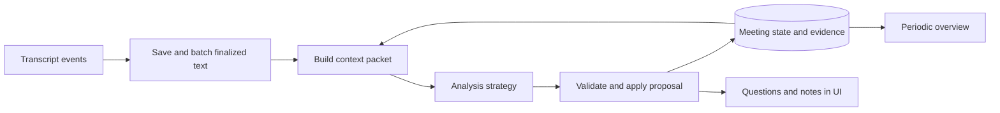

# Live analysis — design

2026-09-11. Backend implementation now available with mock analysis; see
[implementation reference](../docs/analysis.md). Gemini passed the synthetic integration check (four segments, evidence-linked question and report). The design below records
the intended boundaries; the implementation choices section identifies remaining differences.

## Topic-memory strategy

[Topic memory within a meeting](topic-memory.md) is implemented as the opt-in Discussion threads mode in the bottom-left Analysis mode control:
persistent topics, switching/resuming, readiness and bounded evidence retrieval. The default
remains `legacy`; real-provider evaluation is pending. The browser now displays topic context and report groupings.

## How it works
The LLM receives a small packet every time enough new dialogue arrives: the new words, recent conversation, interview goals and what Explore already knows. It returns proposed updates. Explore validates and saves them, then includes the updated state in the next packet. The model does not continuously listen or independently remember the meeting.

Replay and a future live transcript source use the same event contract. Replacing the source does not change the analysis layer. Transcript storage and display continue while a model request is running.

## Replaceable components
These are ordinary application modules, not separate agents or services. Start with one fast model call per batch; splitting responsibilities does not require more calls.

| Component | Responsibility | Why separate |
| --- | --- | --- |
| Trigger policy | Decide when finalized text is ready; impose wait and batch limits | Tune latency without changing reasoning |
| Context builder | Select new/recent text, brief, memory, notes and question ledger within a token budget | Change memory/retrieval independently |
| Analysis strategy | Return proposed facts, gaps, question matches and zero or one follow-up | Replace prompts, rules or agent logic without changing storage/UI |
| Model adapter | Make provider requests and normalize responses/usage | Swap Gemini for another provider independently of strategy |
| Validator and state reducer | Check evidence/version/ownership; apply accepted changes atomically | Keep correctness outside model control |
| Overview strategy | Turn accepted meeting state into a short overview and AI notes | Tune synthesis independently of urgent questions |
| Coordinator | Schedule jobs, capture snapshots, handle retries/budgets and publish committed updates | Keep execution concerns outside reasoning |

Keep contracts in the application/domain layer; provider code implements them. Strategies receive read-only inputs and return proposals: they never write to the database or operate UI components. A deterministic fake implements the same contract for replay tests.

### Core contracts
- `AnalysisInput`: meeting/session ID, job ID, strategy/prompt version, base state version, human-context version, transcript cursor range, exact source revisions, brief, included human notes, structured state, question ledger and recent/new dialogue.
- `AnalysisProposal`: proposed fact additions/revisions/retractions, gaps, question-progress matches and optional question. Each evidence-bearing item references supplied source revisions; observations and hypotheses remain distinct. Provider/model, usage and timing are recorded alongside the proposal.
- `MeetingState`: versioned accepted facts, hypotheses, contradictions, open gaps and coverage, plus processed cursor and evidence references. Question history remains durable even when no longer relevant. Overview/AI notes are derived views of this state, with their own source watermark.

Use a monotonic ingestion cursor for processing; transcript timestamps determine conversational order. Corrections arrive as new revisions/events even when their spoken timestamp is old. A retry uses the same job identity so applying it cannot duplicate questions or facts. Commit the accepted proposal and cursor together. A failed job must not mark its dialogue processed.

Initially persist one current state snapshot plus immutable analysis runs and revisioned source evidence. Add a dedicated migration for state checkpoints and proposal contracts; existing analysis-run JSON alone is not the new memory implementation. A strategy swap must preserve the contract or explicitly migrate/rebuild derived state from saved transcript. No vector database is required for this meeting-local MVP.

## Worked interview example
Brief: understand how small agencies prepare client reports. Rows below are separate batches, not a preloaded conversation. Each request sees only dialogue received so far.

| New dialogue | Accepted memory after analysis | Possible suggestion |
| --- | --- | --- |
| Customer: “Every Friday I copy figures from three tools into a spreadsheet. It takes two hours.” | Workflow: weekly report; manual copying; three tools; two hours. All cite this passage. | “During your most recent two-hour Friday reporting process, how did you copy the figures from those three tools into the spreadsheet?” |
| Cofounder asks that question. Customer: “Last Friday a number was wrong, and I spent another hour checking it.” | Add a concrete error/rework example; link the asked question to its answer evidence. | “What happened as a result of that error?” |
| Customer: “Nothing serious. The client never saw it, and errors are rare.” | Record low reported impact and rare errors; revise any hypothesis that errors are a major pain. | Possibly no new question. |

Questions accumulate as a ledger, not a freshly replaced list. The model proposes which existing question was asked or answered; the application applies the chosen confirmation policy. It should not ask how long reporting takes after the customer already supplied that fact. If an existing queued question becomes covered, retain its history and mark the coverage with evidence rather than generating a duplicate.

The overview might become: “Weekly reporting takes two hours across three tools. One recent error required an extra hour; customer reports errors are rare with low impact.” An automation opportunity is a hypothesis, not proof of demand. Human notes and the original brief remain unchanged.

## Specific follow-ups
Anchor each question in the customer's named workflow, incident or stated impact. Ask about the missing detail using their terminology; avoid generic prompts when an evidence-backed reference is available. Do not repeat an already answered question or insert unsupported numbers, actors, timing or causality. A recurring Friday process alone does not prove it happened last Friday: ask about “the most recent Friday reporting process” unless that date was established.

For example, after “The transaction workflow took six hours to get started,” suggest: “For the transaction workflow you said took six hours to start, what happened during that wait?” Only mention receiving a request if that trigger was established. The evidence reference must support the question's premise. Prefer one clear, neutral question over multiple bundled questions or a leading sales pitch.

Replay evaluations must check specificity and factual premises as well as relevance. A question can be grammatically good yet fail if it invents the workflow trigger or treats a hypothesis as fact.

## Full records and final output
Save all accepted transcript revisions independently of the model context window. Use the shared notes/report section schema, participant metadata, transcript exports and report-finalization flow in [meeting records and final reports](meeting-reports.md). Live analysis updates structured evidence; a separate final report job synthesizes the full meeting after pending analysis completes. Neither a rolling summary nor a report replaces source evidence.

## First Gemini milestone
Keep the existing provider adapter and local source of truth. Verify a real Gemini call with synthetic dialogue, validate structured results and measure latency/cost before enabling automatic question-progress changes. The confirmation policy for AI-inferred answers is awaiting user input.

## Triggering
- Show interim transcript immediately; analyze finalized text.
- Current timing is specified in [live pacing refinement](#live-pacing-refinement--2026-09-12).
  Topic boundaries and semantic readiness are handled by the opt-in [topic memory](topic-memory.md);
  a quiet window does not prove a topic or speaking turn is complete.
- A provider-final sentence is not necessarily a finished speaking turn. Replay should exercise multiple sentences per turn, pauses and interruptions. Short corrections/negations are meaningful, even without many words.
- Keep a per-session analysis watermark. Send new finalized dialogue plus recent conversational context; never discard raw transcript after processing.
- One active urgent call and one coalesced pending batch. Silence creates no repeated calls.

## Context envelope
1. Trusted application policy (Mom Test, evidence rules, output contract).
2. Human meeting brief and explicitly included notes, labeled separately from customer evidence.
3. Small structured meeting state: workflow, pains, frequency, impact, workarounds, spend, decision roles, hypotheses, contradictions, open gaps, topic coverage. Every factual entry cites source revisions.
4. Question ledger: queued/asked/answered, evidence, human overrides and already-covered intent.
5. Recent raw dialogue (initially 60–120 seconds, subject to token budget) plus unprocessed text.

Retain older evidence in SQLite and retrieve referenced passages when needed. Summary is a derived view, not the sole memory. Summarizer checkpoints record the transcript watermark, context version and citations. Corrections invalidate dependent state and trigger reconciliation.

## Outputs and cadence
- Fast job: proposed state changes, question-progress candidates with answer spans, zero or one timely follow-up. Start with small output limits; do not manufacture questions to fill the queue.
- Overview job: periodically synthesize accumulated evidence, about every 20–30 seconds when dirty, on an explicit refresh and after the final pending analysis drains at stop. Preserve workflow/gap/opportunity distinctions and label inference.
- Brief stays human-authored. Notes stay human-authored; any AI notes/summaries are separate derived records. Neither is silently rewritten.
- Human question status takes precedence. Add rejected/dismissed suggestions and covered intent to prevent rephrased duplicates.

## Freshness and validation
The previous code discarded every result when finalized input advanced, which could starve analysis. Implemented replacement: results are tied to processed watermarks; compatible incremental state can commit even when newer text is queued. Corrected source revisions and changed human context invalidate dependent results. Validate candidate relevance/freshness against the pending dialogue and existing question state; do not imply a suggestion covers words it has not processed.

For the MVP, commit compatible evidence/state through the captured cursor, but defer a new question when newer finalized dialogue is pending. The next coalesced call checks that candidate against the new dialogue before publishing it. This avoids pretending a cheap string check can establish semantic relevance. Continuous speech can delay a question; turn boundaries and measured latency will guide later improvements. Version conflicts require rebuilding context rather than blindly merging model patches. A reset creates a new session identity, so an old response cannot populate the new run.

Validate IDs/schema, distinguish observation from inference, enforce question deduplication, preserve history and allow no suggestion. Push validated updates to UI; existing polling adds up to 800 ms plus request time. Measure chunk wait, provider time, validation and display separately; a roughly 3-second post-turn target needs empirical verification.

## Evaluation / cost
Use fixed replay checkpoints: vague pain, concrete example, answered topic, short denial, contradictory correction, long answer and no pain. Evaluate usefulness, repeated/leading questions, evidence precision, answer-detection precision and end-to-end p50/p95 latency. Record tokens/cost using configured provider pricing. The existing 100-call cap can be exhausted in a long meeting; define per-job quotas and a total session budget before sustained use.

## Implementation order
1. Define contracts and the state checkpoint migration; keep the existing mock and Gemini adapters behind the model boundary.
2. Add batching, cursor-based scheduling and atomic proposal validation/application. Exercise replay, corrections, retries and reset races without paid calls.
3. Add structured context updates and evidence-linked question/answer proposals; verify a real Gemini request with synthetic dialogue. Keep the API key on the backend.
4. Add periodic overview/AI notes and UI progress indicators; retain human control of brief, notes and question status until the confirmation policy is chosen.
5. Compare replay quality, latency and cost at fixed checkpoints before tuning timings or adding more agents.

## Implementation choices
Implemented: bounded idle/max-wait batching, state/proposal/provider boundaries, persistent revision
coverage and claims, question-match proposals, exact evidence validation, report finalization and
export APIs. Question status stays manual. All model execution remains mock by default.

For the MVP, overview and report formatting are deterministic strategies over accepted state, so
updating an overview on each batch costs no extra model call. The proposed 20–30-second separate
LLM synthesis job is unnecessary until we evaluate narrative quality with Gemini. Batching currently
uses idle/max-wait rather than a speaker-change trigger. Context uses bounded recent segments instead
of a timed 60–120-second window. These choices keep scheduling simple while retaining full sources.

Dedicated report/participant/export UI controls, answer-confirmation UI, semantic duplicate detection,
explicit claim retraction operations and broader real-model quality/latency/cost evaluation remain future work.
Corrected source dependencies are already removed from current memory, with original history retained.

## Agent APIs
OpenAI Agents API provides a managed harness with durable sessions, orchestration, compaction, recovery and tools. Potential later job: search workspace meetings/notes, inspect contradictory evidence and prepare an evidence-linked synthesis. Agents SDK runs orchestration in our application; Responses API exposes model calls and tools. These do not decide Explore's transcript chunking or evidence policy for us. Keep live Gemini analysis independent of optional later agent execution.

Sources: [OpenAI Agents API](https://developers.openai.com/api/docs/guides/agents-api/overview), [Agents SDK](https://developers.openai.com/api/docs/guides/agents/sdk), [Gemini structured outputs](https://ai.google.dev/gemini-api/docs/generate-content/structured-output).

## Live pacing refinement — 2026-09-12
- Native audio batches wait for four seconds without a new finalized fragment, with a
  25-second maximum collection window. A maximum-window flush updates notes only;
  question eligibility requires the quiet window. Require at least 35 words in the selected context
  before a live call; shorter opening fragments remain pending. Finalization bypasses this
  threshold so no accepted evidence is omitted. Replay/injection retain the fast test cadence.
- Context accepts up to 60 fragments within its existing 24K-character new-text budget,
  preventing tiny STT segments from displacing useful context. Stored text is never merged
  or truncated. Display groups consecutive same-speaker segments across gaps up to eight
  seconds, bounded to one minute per paragraph; each source retains its highlight anchor.
- Each meeting stores a question interval: 30, 60 (default), 120 seconds, or off. This is a
  minimum interval between persisted suggestions, not a promise to produce a question.
  Notes still update when questions are off or cooling down. The repository checks the
  latest persisted question timestamp, so restarting does not reset the interval.
- A second check before committing suppresses questions when new final speech is pending,
  interim text remains, the interval has not elapsed, or finalization is running. The
  prompt asks for no question while a thought is incomplete and includes discarded history.
  These are conservative heuristics, not semantic turn detection; real interview evaluation
  remains necessary to tune completeness and question quality.
- Discard is reversible and retains source evidence, status history and deduplication.
  Discarded questions are excluded from active progress; restoring returns them to queued.
