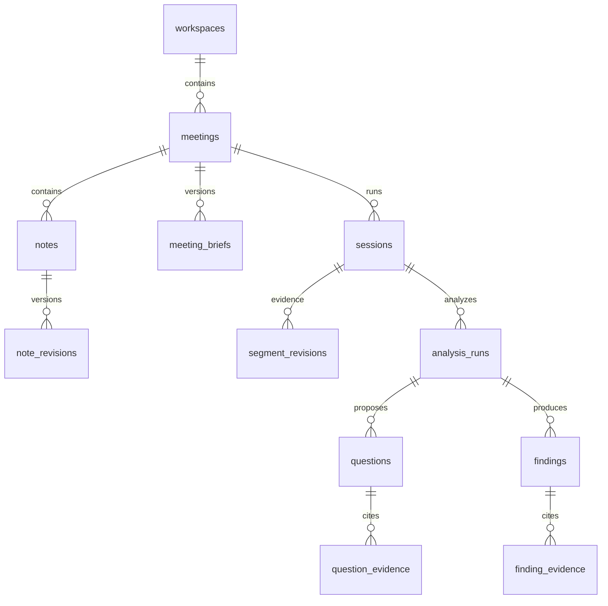

# Explore data model

SQLite, one backend process, foreign keys enabled on every connection. Repository operations run off the event loop under the service ordering lock. UUIDs identify records; UTC timestamps record changes. Human-editable resources use integer revisions and reject stale writes with HTTP 409.

Accepted revisions are also retained in a [separate transcript archive](transcript-archive.md),
outside working-data cleanup. Both SQLite files use rollback journals/FULL synchronous writes
for atomic ingestion; `transcript_archive_binding` records the archive identity. The independent
archive schema has version 1 and append-only sessions, events and context snapshots.

## Ownership

- **Workspace:** a research initiative or customer segment. Meetings belong to exactly one workspace.
- **Meeting:** stable identity, title and context version. Context version changes when brief, notes or question statuses change.
- **Session:** a transcript/replay run within a meeting. A reset replaces its ID, so old producers cannot write into the fresh run. The current implementation maintains one run per meeting; reset is destructive rather than an archive operation.
- **Brief:** versioned JSON with validated fields for customer, vertical, objective, background, hypotheses and guidance. JSON allows the context envelope to evolve without coupling provider code to every field.
- **Notes:** independently addressable text records with edit revisions and timestamps. Older text is retained in `note_revisions`. Notes survive a test reset.
- **Transcript:** `segments` holds current text; `segment_revisions` retains each accepted revision. Deduplication uses `seen_events`. A speaker ID is scoped to a session, not assumed to be a global person.
- **Analysis runs:** immutable request context, input transcript/context versions, provider/model/prompt identity, output, token usage, timing, stale/error indicators. The existing experiments JSON stores replay/runtime state; it is not the source of truth for questions or notes.
- **Questions:** retained, deduplicated by normalized text within a session; queued/asked/answered with optimistic revisions and status history. Status is explicitly set by a human in this iteration; no automatic answer detection is claimed.
- **Findings:** workflow/gap/opportunity with observed/inferred basis. Each successful analysis supplies a new overview; prior runs and findings remain queryable. Automation possibilities must be inferred hypotheses.
- **Evidence:** relational links to exact `(session_id, segment_id, revision)` records. Foreign keys prevent references to another run. Corrected evidence remains inspectable and is marked superseded. Question evidence currently records the basis for asking; a manual answered status does not assert a separately verified answer span.

## Consistency and reset

No provider call holds the database lock. A completed call is discarded if one of its supplied source revisions or the human meeting context changed. Compatible newly appended dialogue remains pending while accepted state commits. Invalid evidence IDs are rejected. The analysis result and its question/finding/evidence records commit together.

Meeting reset requires the expected session ID. It stops ingestion on that run, cancels and awaits replay/analysis work, then transactionally deletes working run data and returns the meeting to Draft. The next start creates a fresh session. A repeated reset using the old ID returns 409. Workspace clearing now rejects live sessions and archives the workspace's meetings without deleting any working data. Confirmed permanent deletion is available per archived meeting; it preserves the independent transcript archive. Database work is awaited even when its calling coroutine is cancelled, so locks cannot release before a worker thread finishes writing.

## Migration

`schema_migrations` records forward-only schema versions. Migration 1 adds the discovery entities, assigns existing sessions to **My workspace**, preserves transcript IDs/text and saved objectives, and backfills the available transcript revision. Revisions discarded by older code cannot be reconstructed. Existing legacy experiment JSON is retained; historical suggestions in that JSON are not promoted to new question rows.

Before migrating a legacy database, `Storage.initialize` makes a consistent SQLite backup at `meetings.before-discovery.sqlite3`. Schema changes and backfill are transactional and idempotent. Startup marks interrupted live sessions stopped. The automatic migration backup is not updated by reset/delete actions.

## API

- `GET/POST /workspaces`; `GET/POST /workspaces/{id}/meetings`
- `GET /meetings/{id}` returns current run, brief, questions, overview, findings and notes.
- `PUT /meetings/{id}/brief` accepts `{revision, brief}`.
- `POST /meetings/{id}/notes`; `PUT /meetings/{id}/notes/{noteId}` accepts `{body, revision}`.
- `PATCH /meetings/{id}/questions/{questionId}` accepts `{revision, status}`.
- `POST /meetings/{id}/reset` accepts `{session_id}`.
- `POST /workspaces/{id}/meetings/archive` archives the workspace's meetings; the deprecated bulk DELETE route now does the same.
- Existing `/sessions/{id}` replay, injection and WebSocket endpoints remain available.

The browser polls meeting state every 800 ms, cancelling obsolete loads. Selection IDs alone are remembered in localStorage; content lives in SQLite. This adds up to one polling interval plus request time to display latency. The WebSocket contract remains available for faster future UI transport.

## Analysis/report migration 2

- `analysis_state`: current structured claims, question-match proposals, workflows, processed revision coverage and overview, keyed by session. Updated atomically with accepted analysis runs; immutable run input/output retains prior state/proposal provenance.
- `meeting_participants`: human participant/speaker mappings with optimistic revision checks. Roles remain unknown unless supplied. Context version advances when edited; existing reports preserve their earlier participant snapshot.
- `report_jobs`: durable finalization status/error, keyed by session. Interrupted jobs become failed on startup.
- `reports`: immutable structured reports, unique by session/source/context version and numbered within the session. Includes exact evidence, note snapshots and generation provenance.

Session-owned additions cascade on run deletion; participant mappings survive reset and cascade only
with meeting deletion. Migration is transactional and idempotent; upgrading a version-1 database first saves a consistent
`meetings.before-analysis.sqlite3` backup. Existing historical runs are not
silently converted to new structured memory: finalization processes retained current finals as needed.
See [analysis and report APIs](analysis.md) for coverage, exports and finalization semantics.

## Future context brain

[Speaker separation and confirmed attribution](../design/speaker-attribution.md) is implemented
by migration 7 below. Legacy `speaker_id` values remain source associations, not confirmed identities.

Build retrieval over meeting briefs, note revisions and transcript evidence. Store derived claims with their run provenance and exact citations; do not overwrite original observations with agent summaries. Cross-meeting retrieval, embeddings, authors/permissions, automatic answer-span detection, pagination and retention policies are not implemented here. This remains a single-host MVP, not a multi-tenant hosted service.

## Meeting controls (migration 3)
`meetings.archived` is a checked boolean, and `question_interval` is one of 0/30/60/120
seconds (default 60). `PATCH /meetings/{id}/preferences` requires the current
`context_version` as `revision`; updates increment it and invalidate stale analysis.
Archiving requires a stopped session, preserves all content and is reversible. Restore a
meeting before resetting its test. Workspace clear archives all its meetings; it does not delete their working records.

`questions.discarded` preserves the previous stored status while the API projects
`status=discarded` in question lists, context and exports. Discard/restore use the existing
revision-checked question endpoint and append status events. Original evidence remains intact.
The migration adds columns transactionally, backfills defaults, and preserves existing keys.

## Topic memory (migration 4)
- `topics`: session-owned stable IDs, title/summary with exact summary source revisions,
  optimistic projection revision and latest owning analysis run. Active/paused status derives
  from `analysis_state.topic_state.focus_id`; old runs preserve proposal provenance.
- `topic_evidence`: many-to-many topic/source revision links, with accepted/provisional assignment.
- `topic_artifacts`: current claim/workflow key associations, rebuilt with accepted memory.
  JSON artifact references are validated in application code; topic ownership has composite FKs.
- `question_topics`: question/topic/session link and normalized intent, unique within that
  session/topic. Discard/restore preserves it, preventing exact-intent reissues.

Migration 4 leaves existing sessions/topics unassigned and makes no provider calls. Run reset
removes topic rows before dependent transcript/run records; archive retains them. Foreign keys
and transaction rollback protect cross-session evidence and atomic state/run/topic writes.
Current summaries whose sources were corrected are withheld until refreshed; old versions remain
in analysis runs. The [topic design](../design/topic-memory.md#storage-and-contracts) records the
boundaries and limitations. Existing human content and transcript revision retention are unchanged.

## Analysis preference (migration 5)
`analysis_preferences` contains at most one local-app row: `id=1`, checked `strategy`
(`legacy` or `topics`) and a positive optimistic `revision`. It deliberately has no session or
workspace foreign key: the bottom-left control affects new batches throughout this local app.
Creation/update is transactional; concurrent stale writes fail instead of overwriting. Before
the first save, the server's initial mode is returned with revision 0. After a save, database
state takes precedence. Meeting reset/archive and workspace clear preserve the preference.
The migration changes no existing interview records and triggers no provider work.

## Migration 6: preparation, source isolation and diagnostics
- `sessions.mode`: `legacy` for retained data; new starts store immutable `real` or `test`.
- `sessions.roster_snapshot`: JSON of validated participants at start; editable roster revisions
  remain in `meeting_participants`. Draft meetings have no session row.
- `runtime_preferences`: singleton Test mode flag, off on first migration.
- `session_producers`: one source family per session; foreign key cascades on test reset.
- `capture_runs`: capture ID, session FK, metadata-only JSON counters and update time. Interrupted
  runs become failed at startup. Reset cascades only that meeting's capture audit.
- `findings.topic_id/workflow_key`: explicit composite logical reference to validated workflow
  memory. Empty means unassigned; immutable analysis output keeps the proposal and evidence.

Migration is transactional and idempotent. Existing transcripts, notes and reports are preserved.

## Migration 7: confirmed speaker attribution
- `participant_identities`: stable meeting-owned identity; unique legacy roster ID within a meeting.
  Existing IDs/names/roles and immutable session snapshots are preserved. New participant IDs are
  server-assigned and hidden from the roster form; a participant is not an authenticated app user.
- `participant_rosters`: append-only application history of each saved roster revision. Migration
  backfills the current roster only; it does not invent earlier changes.
- `speaker_tracks`: session + capture + channel + provider label; single-person source and diarized
  methods stay distinct. No speaker-0 reuse across channels/captures implies the same person.
- `speaker_spans`: Unicode character range on an exact `segment_revisions` key, linked to a track
  or unknown. Parent timestamps stay unchanged. The accepted event stores its metadata envelope too.
- `speaker_assignments`: append-only human track confirmations or exact-revision passage overrides,
  actor, roster revision and session attribution version. Clearing is a new row. Composite foreign
  keys reject cross-meeting participants, tracks and evidence. UI also enforces optimistic versions.
- `sessions.attribution_version`: changes on roster/assignment edits; analysis reads it, rejects
  stale proposals, and reprocesses old evidence without changing raw transcript revisions.

Migration is transactional/idempotent with a one-time working-database backup. Existing
channel-only audio sessions are marked for attribution review; their text, human content and
prior report snapshots remain unchanged. Assignment transactions
also append permanent archive context snapshots (context schema 2); text + observations commit to
working storage and archive before ACK. Archive table schema stays 1 because only JSON envelopes grow.
Reset removes working attribution rows in dependency order after archiving; immutable archive contexts
and events retain history. Full export schema 2 includes current resolution and all assignment/roster
revisions. Missing archive or write failure rolls back the entire human confirmation.

## Organization and observed questions (migrations 8–9)
Migration 8 adds checked `workspaces.archived` and nonnegative optimistic `revision` columns.
Existing workspaces remain active. Effective meeting archive = meeting flag OR workspace flag;
workspace restore does not change child flags. See [archive design](../design/archives-and-question-history.md).

Migration 9 adds `spoken_questions(id, session_id, run_id, text, created_at)` and
`spoken_question_evidence(question_id, session_id, segment_id, revision, start, end)`.
Composite foreign keys scope run and exact source revisions to the same session; offsets reference
original Unicode characters. Stable IDs hash ordered revision/range anchors within the session.
No cross-meeting deduplication or roster inference occurs. Attribution is resolved from existing
speaker assignments; source corrections mark observations superseded without deleting them.

- `GET /archives/meetings`: individually/effectively archived meetings with workspace name and mode.
- `POST /workspaces/{wid}/meetings/archive`: atomic archive, rejecting any live interview.
- `PATCH /workspaces/{wid}/archive`: `{revision, archived}`; rejects stale writes/live archive.
- `DELETE /workspaces/{wid}/meetings/{mid}`: `{revision, confirmed: true}`; archived records only,
  blocks live sessions/pending reports, preserves the independent transcript vault atomically.
- Deprecated bulk `DELETE /workspaces/{wid}/meetings` now archives instead of purging.
- Meeting detail and transcript JSON include `spoken_questions`; new report sections include
  detected questions, exact evidence, speaker/role and supersession. Old reports remain immutable.

All endpoints remain local-host protected, not a hosted multi-tenant authorization implementation.

## Developer diagnostics (migration 10)
`developer_traces(id, session_id, job_id, model, created_at, outcome, metadata, request_body,
response_body)` stores one record per analysis attempt. The session foreign key cascades on working
reset/deletion; archive/restore does not change diagnostics. A request ID is unique per attempt;
the stable analysis job ID may recur across retries. Running rows become interrupted at startup.
Existing data is preserved by an idempotent transactional migration.

Bodies default to null, are opt-in and bounded/redacted; they never enter the transcript archive.
Keep 100 attempts for 24 hours, with per-minute/read/write pruning. Normal analysis runs expose only
the request ID and safe provider/validation codes. A separate mode-600 rotating JSONL file stores
allowlisted metadata events. Clearing diagnostic history does not change meeting data or spend.
In-flight writes use a generation check so late results cannot repopulate cleared history.

Local admin key/cookie digests are outside this schema: the private key is in the data directory;
cookie hashes and expiries exist only in process memory. This is local-owner access, not team RBAC.
See [design](../design/observability.md) and [usage](developer-tools.md).

## Manual analysis scheduling (migration 11)
`meetings.analysis_schedule` is `manual` or `automatic`; `schedule_revision` fences stale setting
writes. Existing rows migrate to Automatic; new rows are explicitly Manual. Reset retains the choice.

`manual_analysis_jobs` belongs to a session (cascade on authorized working reset/deletion). It stores
UUID idempotency key, fingerprint, frozen input JSON, timestamp, status and safe error. A partial unique
index allows one running receipt per session. Job creation and `experiments.calls` reservation are one
transaction; successful ACK shares the artifact/coverage transaction in `Discovery.record_run`.
Startup turns running jobs into interrupted jobs without redispatch. Full accepted input/output stays
in `analysis_runs`; memory's `manual_fingerprint` prevents unchanged successful resubmission. Human
content and protected transcript-vault retention are unchanged. See [contract](../design/context-rebuild.md).

Migration 12 adds `model_selection`: one local application choice with provider, model and optimistic
revision. Keys are not stored here. Frozen analysis inputs retain the selection; manual fingerprints
include it. Existing source/evidence and report revisions are unchanged.

## Final review and report revisions (migration 13)
Final reviews reuse session-owned manual receipts with frozen `review_kind=final` inputs and the
same atomic validated analysis commit. Memory records `final_review_fingerprint` and
`final_review_version` to reuse only an unchanged successful review. No transcript is rewritten.
Reports retain unique (session_id, revision); migration 13 removes the old uniqueness constraint
on source/context versions while preserving every payload. New report JSON includes analysis_version,
so improved analysis can create a report revision without a transcript edit. Human notes stay separate.

Final-review reservations are counted from session-owned manual_analysis_jobs whose frozen input has
review_kind=final, including failed/interrupted attempts. They survive backend restart and do not
increment the live/manual experiments.calls counter. Existing final receipts count toward the new
allowance; old live counters are preserved conservatively. No migration or usage reset is needed.
