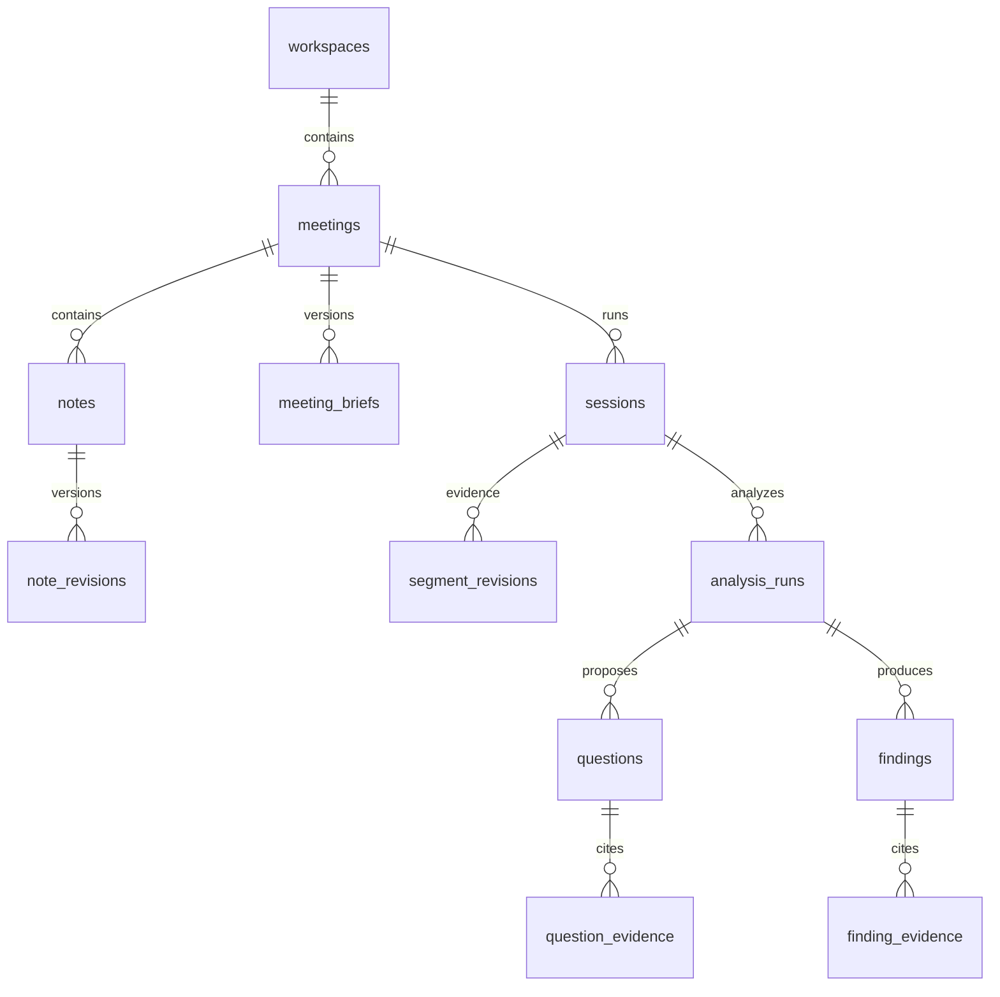

# Explore data model

SQLite, one backend process, foreign keys enabled on every connection. Repository operations run off the event loop under the service ordering lock. UUIDs identify records; UTC timestamps record changes. Human-editable resources use integer revisions and reject stale writes with HTTP 409.

## Ownership

- **Workspace:** a research initiative or customer segment. Meetings belong to exactly one workspace.
- **Meeting:** stable identity, title and context version. Context version changes when brief, notes or question statuses change.
- **Session:** a transcript/replay run within a meeting. A reset replaces its ID, so old producers cannot write into the fresh run. The current implementation maintains one run per meeting; reset is destructive rather than an archive operation.
- **Brief:** versioned JSON with validated fields for customer, vertical, objective, background, hypotheses and guidance. JSON allows the context envelope to evolve without coupling provider code to every field.
- **Notes:** independently addressable text records with edit revisions and timestamps. Older text is retained in `note_revisions`. Notes survive a test reset.
- **Transcript:** `segments` holds current text; `segment_revisions` retains each accepted revision. Deduplication uses `seen_events`. A speaker ID is scoped to a session, not assumed to be a global person.
- **Analysis runs:** immutable request context, input transcript/context versions, provider/model/prompt identity, output, token usage, timing, stale/error indicators. The existing experiments JSON stores replay/runtime state; it is not the source of truth for questions or notes.
- **Questions:** retained, deduplicated by normalized text within a session; queued/asked/answered with optimistic revisions and status history. Status is explicitly set by a human in this iteration; no automatic answer detection is claimed.
- **Findings:** workflow/gap/opportunity with observed/inferred basis. Each successful analysis supplies a new overview; prior runs and findings remain queryable. Automation possibilities must be inferred hypotheses.
- **Evidence:** relational links to exact `(session_id, segment_id, revision)` records. Foreign keys prevent references to another run. Corrected evidence remains inspectable and is marked superseded. Question evidence currently records the basis for asking; a manual answered status does not assert a separately verified answer span.

## Consistency and reset

No provider call holds the database lock. A completed call is discarded if one of its supplied source revisions or the human meeting context changed. Compatible newly appended dialogue remains pending while accepted state commits. Invalid evidence IDs are rejected. The analysis result and its question/finding/evidence records commit together.

Meeting reset requires the expected session ID. It stops ingestion on that run, cancels and awaits replay/analysis work, then transactionally deletes run data and creates a fresh session. A repeated reset using the old ID returns 409. Workspace clearing coordinates the same shutdown and removes only that workspace's meetings, briefs, notes and run data. The workspace remains. Database work is awaited even when its calling coroutine is cancelled, so locks cannot release before a worker thread finishes writing.

## Migration

`schema_migrations` records forward-only schema versions. Migration 1 adds the discovery entities, assigns existing sessions to **My workspace**, preserves transcript IDs/text and saved objectives, and backfills the available transcript revision. Revisions discarded by older code cannot be reconstructed. Existing legacy experiment JSON is retained; historical suggestions in that JSON are not promoted to new question rows.

Before migrating a legacy database, `Storage.initialize` makes a consistent SQLite backup at `meetings.before-discovery.sqlite3`. Schema changes and backfill are transactional and idempotent. Startup marks interrupted live sessions stopped. The automatic migration backup is not updated by reset/delete actions.

## API

- `GET/POST /workspaces`; `GET/POST /workspaces/{id}/meetings`
- `GET /meetings/{id}` returns current run, brief, questions, overview, findings and notes.
- `PUT /meetings/{id}/brief` accepts `{revision, brief}`.
- `POST /meetings/{id}/notes`; `PUT /meetings/{id}/notes/{noteId}` accepts `{body, revision}`.
- `PATCH /meetings/{id}/questions/{questionId}` accepts `{revision, status}`.
- `POST /meetings/{id}/reset` accepts `{session_id}`.
- `DELETE /workspaces/{id}/meetings` clears that workspace's meetings.
- Existing `/sessions/{id}` replay, injection and WebSocket endpoints remain available.

The browser polls meeting state every 800 ms, cancelling obsolete loads. Selection IDs alone are remembered in localStorage; content lives in SQLite. This adds up to one polling interval plus request time to display latency. The WebSocket contract remains available for faster future UI transport.

## Analysis/report migration 2

- `analysis_state`: current structured claims, question-match proposals, workflows, processed revision coverage and overview, keyed by session. Updated atomically with accepted analysis runs; immutable run input/output retains prior state/proposal provenance.
- `meeting_participants`: human participant/speaker mappings with optimistic revision checks. Roles remain unknown unless supplied. Context version advances when edited; existing reports preserve their earlier participant snapshot.
- `report_jobs`: durable finalization status/error, keyed by session. Interrupted jobs become failed on startup.
- `reports`: immutable structured reports, unique by session/source/context version and numbered within the session. Includes exact evidence, note snapshots and generation provenance.

Session-owned additions cascade on run deletion; participant mappings survive reset and cascade only
with meeting deletion. Migration is transactional and idempotent; upgrading a version-1 database first saves a consistent
`meetings.before-analysis.sqlite3` backup. Existing historical runs are not
silently converted to new structured memory: finalization processes retained current finals as needed.
See [analysis and report APIs](analysis.md) for coverage, exports and finalization semantics.

## Future context brain

Build retrieval over meeting briefs, note revisions and transcript evidence. Store derived claims with their run provenance and exact citations; do not overwrite original observations with agent summaries. Cross-meeting retrieval, embeddings, authors/permissions, automatic answer-span detection, pagination and retention policies are not implemented here. This remains a single-host MVP, not a multi-tenant hosted service.
